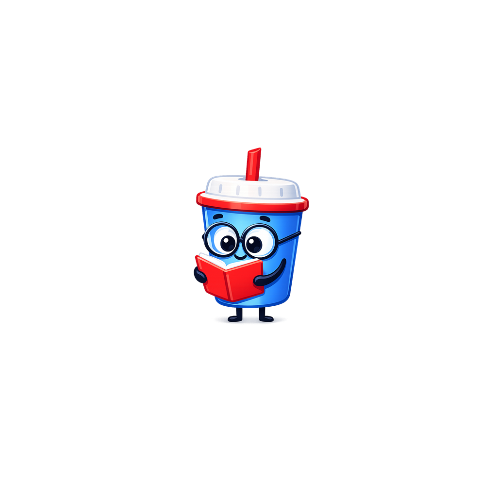

# FinalAI - Yapay Zeka Destekli Akilli Ogrenme Platformu

<p align="center">
  
</p>

<p align="center">
  <strong>Kisisellestirilmis, oyunlastirilmis ve yapay zeka destekli ogrenme deneyimi.</strong>
</p>

<p align="center">
  
  
  
  
</p>

---

## Ozellikler

### Yapay Zeka ile Kisisel Ders Plani
- **Gemini AI** ile her kullaniciya ozel unite ve ders icerigi olusturma
- Seviyeye gore icerik derinligi (Baslangic / Orta / Ileri)
- Her kullanici farkli sorular ve farkli anlatim tarzlari gorur
- 6 farkli gorev tipi: Eslestirme, Siralama, Bosluk Doldurma, Coktan Secmeli, Hata Bulma, Gorsel Secme

### Oyunlastirma Sistemi
- **XP & Seviye**: Her ders tamamlamada XP kazan, seviye atla
- **Can Sistemi**: 3 pixel kalp, 2 ardisik dogruda can geri kazanma
- **Kombo**: Art arda ders tamamlama kombolar
- **Seri (Streak)**: Gunluk calisma serileri
- **Liderlik Tablosu**: Tum oyuncular basariya gore siralanir
- **Mukemmel Ders Bonusu**: Hic hata yapmadan bitirene +50 XP

### Pixel Art UI
- 2D pixel game art tasarimi
- Golgelendirmeli kartlar ve animasyonlar
- Lottie maskot animasyonlari
- Unite tamamlama kutlamasi (bisikletli maskot)
- Karanlik/Aydinlik tema destegi

### Akilli Icerik Uretimi
- Her kullanici icin benzersiz sorular
- Konu bazli cesitli soru kaliplari
- Mantikli yanilticilar (random degil)
- Seviyeye uygun zorluk ayarlamasi
- Tekrar onleme mekanizmasi

---

## Teknoloji Yigini

| Katman | Teknoloji |
|--------|-----------|
| **Mobil Uygulama** | Flutter 3.x + Dart 3.x |
| **State Management** | Riverpod |
| **Backend & Auth** | Supabase (PostgreSQL + Auth + Realtime) |
| **Yapay Zeka** | Google Gemini AI |
| **API Sunucusu** | Node.js + Express |
| **UI Sistemi** | Custom Pixel Art Design System (`core_ui`) |
| **Animasyonlar** | Lottie |
| **Navigasyon** | GoRouter |

---

## Proje Yapisi

```
finalai/
├── apps/
│   ├── finalai/          # Flutter mobil uygulama
│   │   ├── lib/
│   │   │   ├── core/         # Repository, servisler, utils
│   │   │   ├── features/     # Feature-based modüller
│   │   │   │   ├── auth/         # Giris/Kayit
│   │   │   │   ├── learning_path/ # Ders sistemi
│   │   │   │   ├── stats/         # Istatistikler & Liderlik
│   │   │   │   ├── profile/       # Profil yonetimi
│   │   │   │   └── documents/     # PDF/Belge isleme
│   │   │   └── navigation/   # GoRouter yapilandirmasi
│   │   └── assets/       # Lottie, logo, ikonlar
│   └── api/              # Node.js Express backend
│       └── src/
│           ├── routes/       # API endpointleri
│           └── middleware/   # Auth, hata yonetimi
├── packages/
│   └── core_ui/          # Paylasilan tasarim sistemi
└── supabase_migrations/  # Veritabani migration'lari
```

---

## Kurulum

### Gereksinimler
- Flutter SDK >= 3.0.0
- Dart SDK >= 3.0.0
- Node.js >= 18.x
- Supabase hesabi
- Google Gemini API anahtari

### Adimlar

```bash
# 1. Repoyu klonla
git clone https://github.com/mustafadmrsy/FinalAI.git
cd FinalAI

# 2. Node bagimliliklerini yukle (API + monorepo)
npm install
cd apps/api && npm install && cd ../..

# 3. Flutter bagimliliklerini yukle
cd apps/finalai && flutter pub get && cd ../..

# 4. .env dosyalarini olustur
# apps/api/.env -> SUPABASE_URL, SUPABASE_KEY, GEMINI_API_KEY
# apps/finalai/lib/core/constants/ -> Supabase credentials

# 5. Calistir
npm run dev:android
```

---

## Calistirma Modlari

```bash
# Android (USB ile)
npm run dev:android:usb

# Android (Wi-Fi ile)
npm run dev:android

# Sadece API
npm run dev --prefix apps/api

# Sadece Flutter
cd apps/finalai && flutter run
```

---

## Gorev Tipleri

| Tip | Aciklama |
|-----|----------|
| `matching` | Kavramlari tanimlariyla esle (surukle-birak) |
| `order_steps` | Adimlari dogru siraya koy (kronolojik/mantiksal) |
| `fill_blank` | Bosluktaki kavram surukle veya sec |
| `tap_select` | 4 secenekli coktan secmeli |
| `spot_error` | Cumlede hatali kelimeyi bul |
| `image_select` | Gorsel tabanli secenek |

---

## Veritabani Tablolari

| Tablo | Amac |
|-------|------|
| `user_profiles` | Kullanici bilgileri, alan, seviye |
| `user_stats` | XP, seri, kombo, enerji, dogru cevap |
| `learning_units` | Ogrenme uniteleri |
| `learning_lessons` | Ders icerikleri ve ilerleme |
| `daily_quests` | Gunluk gorevler |

---

## Ekran Goruntuleri

> Pixel art tasarimli, oyunlastirilmis ogrenme deneyimi

- Ders ekrani (can sistemi + progress bar)
- Eslestirme gorevi
- Liderlik tablosu (genisletilebilir satirlar)
- Unite tamamlama kutlamasi
- Istatistik paneli

---

## Katkida Bulunma

1. Fork'layin
2. Feature branch olusturun (`git checkout -b feature/yeni-ozellik`)
3. Commit'leyin (`git commit -m 'feat: yeni ozellik eklendi'`)
4. Push'layin (`git push origin feature/yeni-ozellik`)
5. Pull Request acin

---

## Lisans

Bu proje ozel bir projedir. Izinsiz dagitim ve kopyalama yasaktir.

---

<p align="center">
  <sub>FinalAI ile ogrenmeyi oyuna donustur.</sub>
</p>
